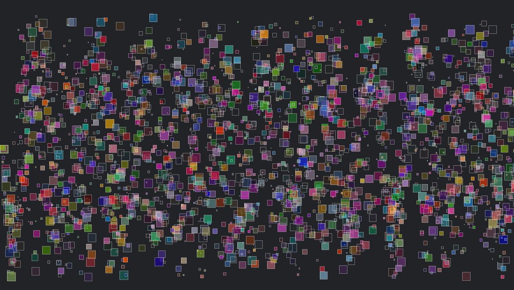
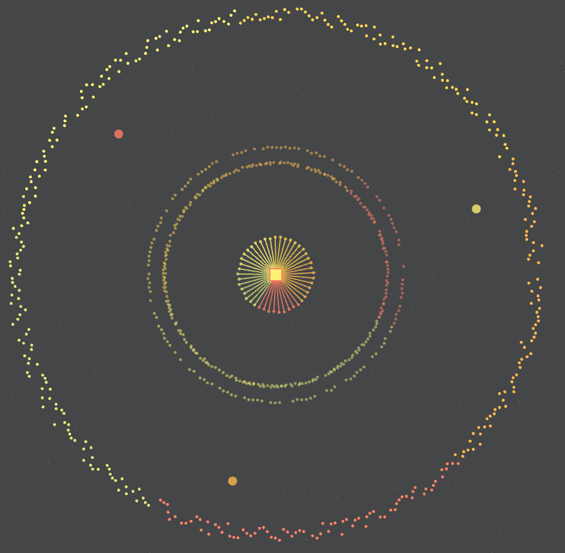

# Processing Sketches

## Random Sine
Static sketch that draws rectanges of varying size and transparency based on a sine function

## FFT Circular Response
Audio reactive visual based on fast fourier transform

[View audio visualizer on YouTube](https://www.youtube.com/watch?v=L7xbkTqUJxI&t=59s)

## MinimalArc
2D Minimalist audio reactive visual. 8 different colored arcs covering 8 frequency bands

[View audio visualizer on YouTube](https://www.youtube.com/watch?v=YReUGS9MuVM)

NOTE: Configured to run in Eclipse environment, will not run in Processing IDE
